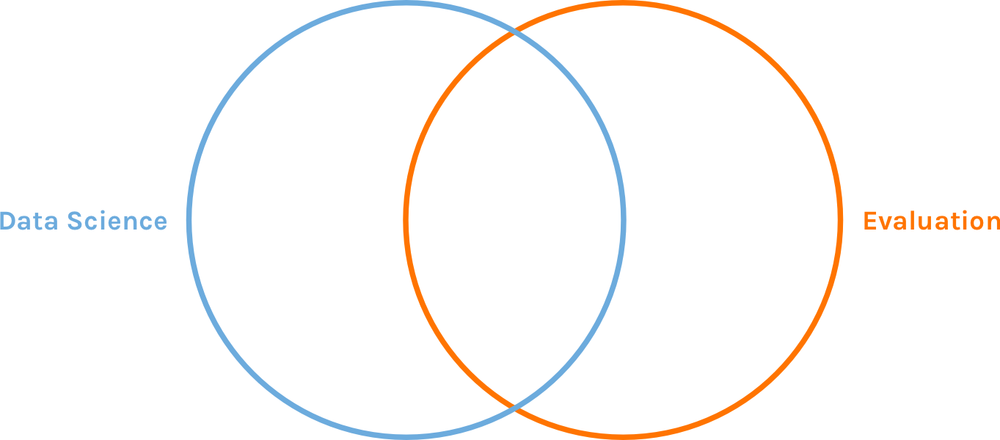

```{r child = "setup.Rmd"}
```

class: center, middle



---

class: center, middle


---

class: center, middle


---

class: center, middle


---

class: center, middle


---

class: center, middle


---

class: inverse, dk-section-title, middle, center

# My Path to<br>"Data Science"

---

class: center

## I'm a Data Scientist?


---

class: center

## How I Learned R

--


???

- The fact that there are so many ways to do anything in R is both a blessing and curse for newbies
- I remember a period of several months where I would do some reading or tutorials about R and then try to work on a project. I think there were at least five projects that I started in R, got to a point where I couldn’t do something, and had to go back to Excel. It was super frustrating!

---

class: center, middle


---

class: center, middle


---

class: inverse, dk-section-title, middle, center

# What is Data Science Exactly?

???

Have people give ideas about what data science is

---

class: center, middle


???

- Sexy field today, both for orgs and individuals
- Branding exercise to get more cache + $
- But if we only think of it as the stats part, we're missing a whole side of what data scientists do 

---

class: center, middle


---

class: inverse, dk-section-title, middle, center

# What Can Data Science Teach Evaluation?

---

class: inverse, dk-section-title, middle

background-image: url("images/mistake.jpg")

## Lesson #1<br>Make your work transparent<br>to catch mistakes<br>before it’s too late

???

- We all make mistakes. Question is just whether we see them before we send out results. 
- Give example of ODS project when I kept having to redownload data and didn't know how I had merged it.
- Code is just a written out version of your work process. Anyone should be able to read it and know what you did. 


---

class: inverse, dk-section-title, middle

background-image: url("images/structure.jpg")

## Lesson #2<br>Think about the<br>structure of your data up front<br>to get better results on the back end

???

- Common for data scientists to complain about messy data
- As evaluators, we have advantage of collecting data
- Don't separate out data colletion and analysis stages in your planning
- Do things like use validation in forms to ensure you get data you can use

---

class: inverse, dk-section-title, middle

background-image: url("images/automate.jpg")

## Lesson #3<br>Automate all the things!

<!--  -->

???

- If you know the structure of data, you can analyze it automatically
- You can automate data cleaning, analysis, and reporting (i.e. not just reporting)
- You can do this in Excel as well (give example of Reading Partners)
- Give example of how I produced report automatically for webinar
- You then have more time to think about what the data *means*

---

class: inverse, dk-section-title, middle

background-image: url("images/workflow.jpg")


## Lesson #4<br>R is a Workflow Tool

???

- Sharla's example
- R isn't just for complex statistical analyses. RMarkdown can improve your workflow tremendously.

---

class: center, middle


---

class: middle

# Don't Just Work *in* your Data<br>Also Work *on* Your Data

???

- From e-myth book
- Don't just analyze your data. Think also in meta ways about your data. 


---

class: middle

# A Little Bit of Code Goes a Long Way

--

> Learning R really doesn’t have to be about learning statistical models or advanced computation methods. I have a masters degree in Statistics and the most statistical thing I do these days is calculate a median.

> Sharla Gelfand

---

class: middle

# R:<br>Inefficient at the Start<br>Waaaaaayyyy More Efficient With Time

---

```{r fig.height = 4}
library(tidyverse)
library(hrbrthemes)
library(gganimate)

df <- tribble(
  ~year, ~with_without_r, ~hours,
  1, "Without R", 25,
  2, "Without R", 25,
  3, "Without R", 25,
  4, "Without R", 25,
  5, "Without R", 25,
  6, "Without R", 25,
  7, "Without R", 25,
  8, "Without R", 25,
  9, "Without R", 25,
  10, "Without R", 25,
  1, "With R", 50,
  2, "With R", 5,
  3, "With R", 5,
  4, "With R", 5,
  5, "With R", 5,
  6, "With R", 5,
  7, "With R", 5,
  8, "With R", 5,
  9, "With R", 5,
  10, "With R", 5
) %>% 
  group_by(with_without_r) %>% 
  mutate(total_hours = cumsum(hours))


ggplot(df, aes(year, total_hours,
               color = with_without_r,
               group = with_without_r)) +
  geom_line() +
  # geom_point() +
  scale_color_manual(values = c("#6cabdd", 
                                "#ffc659")) +
  labs(y = "Total Hours",
       x = "Years") +
  theme(legend.position = "none") +
  annotate("label", 
           x = 3.5, 
           y = 105, 
           label = "Non-R", 
           fill = "#ffc659",
           color = "white") +
    annotate("label", 
           x = 3.5, 
           y = 47, 
           label = "R", 
           fill = "#6cabdd",
           color = "white") +
  theme_ipsum() +
  theme(panel.grid.minor = element_blank(),
        legend.position = "none") +
  scale_y_continuous(limits = c(0, 250)) +
  scale_x_continuous(breaks = seq(1, 10, 1))
    
```

???

- Never Having to redo report with mistake in it: priceless
- Learning how to code is not just about doing stats, it's also about workflow


