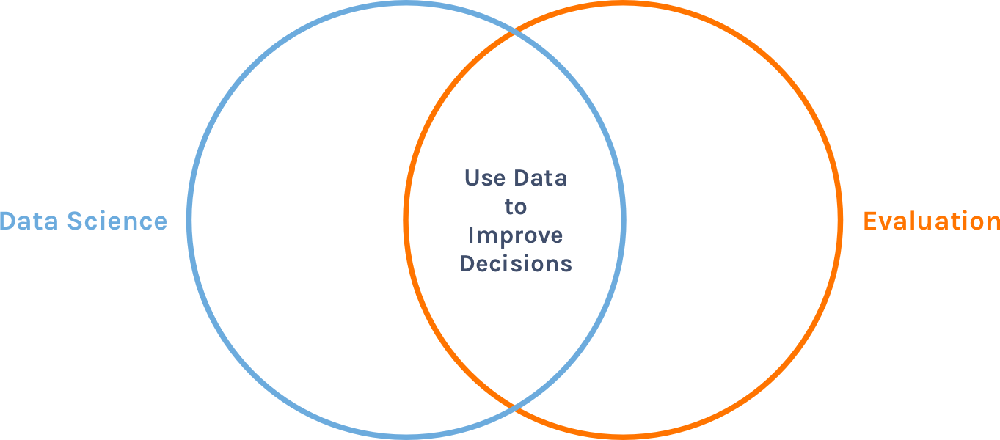
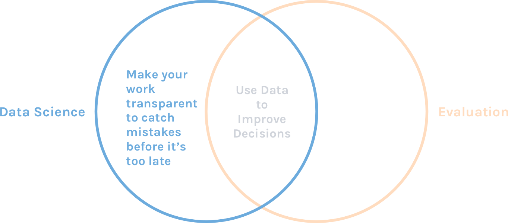
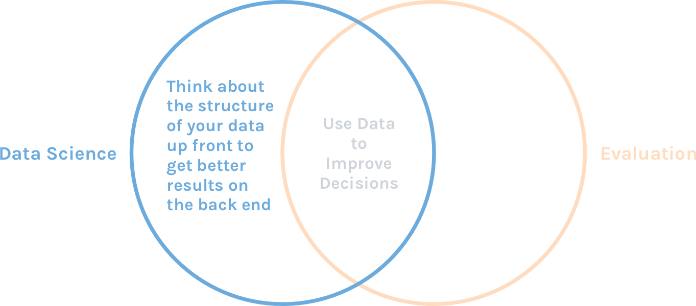
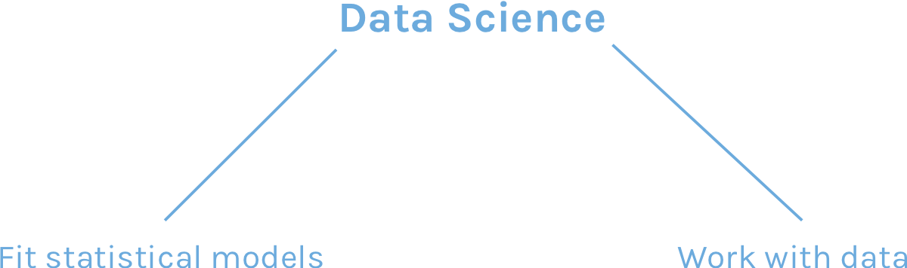

```{r child = "setup.Rmd"}
```

class: center, middle


---

class: center, middle



---

class: center, middle



---

class: center, middle



---

class: center, middle


---

class: center, middle


---

class: inverse, dk-section-title, middle, center

# My Path to "Data Science"

---

class: center

## I'm a Data Scientist?


---

class: center

## How I Learned R

--


???

- The fact that there are so many ways to do anything in R is both a blessing and curse for newbies
- I remember a period of several months where I would do some reading or tutorials about R and then try to work on a project. I think there were at least five projects that I started in R, got to a point where I couldn’t do something, and had to go back to Excel. It was super frustrating!

---

class: center, middle



---

class: center, middle


---

class: inverse, dk-section-title, middle, center

# What is Data Science Exactly?

???

Have people give ideas about what data science is

---

class: center, middle


???

- Sexy field today, both for orgs and individuals
- Branding exercise to get more cache + $
- But if we only

---

class: center, middle


---

class: inverse, dk-section-title, middle, center

# What Can Data Science Teach Evaluation?

---

class: inverse, dk-section-title, middle, center

background-image: url("images/mistake.jpg")

## Lesson #1<br>You will make mistakes. <br>Catch them before it's too late. 


---

class: inverse, dk-section-title, middle, center

## Lesson #2<br>Think about the structure of your data up front to save yourself time on the back end

---

class: inverse, dk-section-title, middle, center

## Lesson #3


---

class: inverse, dk-section-title, middle, center

## Lesson #4<br>R is a Workflow Tool

---

# A Little Bit of Coding Goes a Long Way
